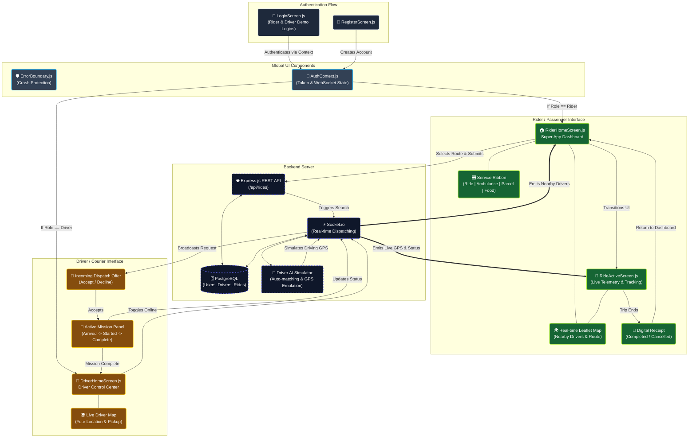

# BharatOne Super App: GUI Flow Diagram

Below is the visual map of the graphical user interfaces and how they connect to the backend system in the BharatOne Super App.

### Key UI Screen Breakdowns:

- **LoginScreen**: Handles standard auth and provides quick-access demo buttons mapping directly to the PostgreSQL seeded test accounts.
- **RiderHomeScreen**: The core Super App dashboard featuring a sleek glassmorphism UI, a real OpenStreetMap (Leaflet), and a quick Service Ribbon to dynamically switch prices and configurations for Ambulances, Taxis, Parcels, or Food.
- **DriverHomeScreen**: Designed for drivers and couriers to toggle their online status, accept incoming requests, and manage the `Arrived` -> `Started` -> `Completed` workflow.
- **RideActiveScreen**: A highly dynamic telemetry screen for riders. It listens to WebSocket streams to show a pulsing radar during searches, driver profiles when matched, live GPS movement during the ride, and a final receipt upon completion.
